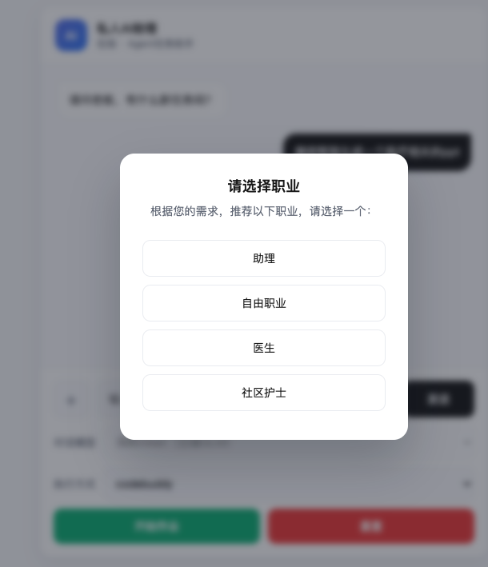
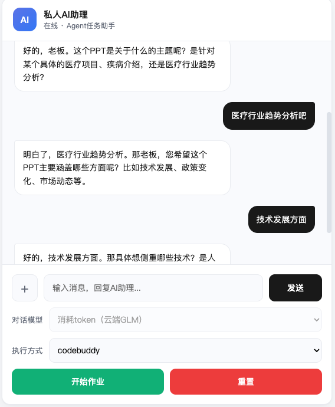
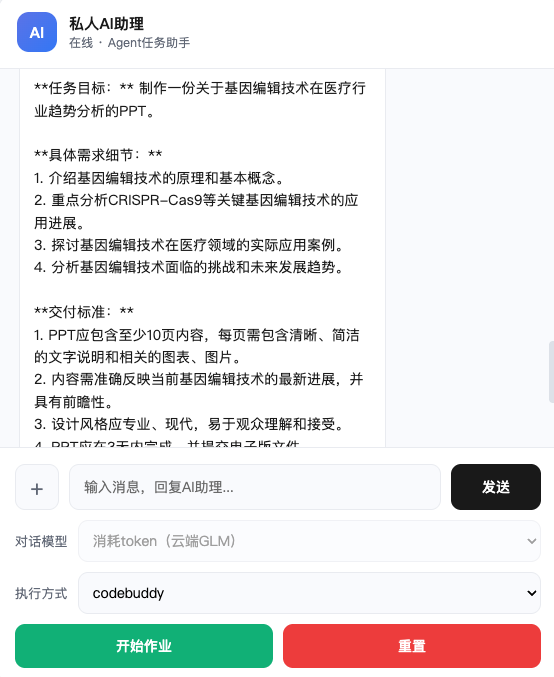
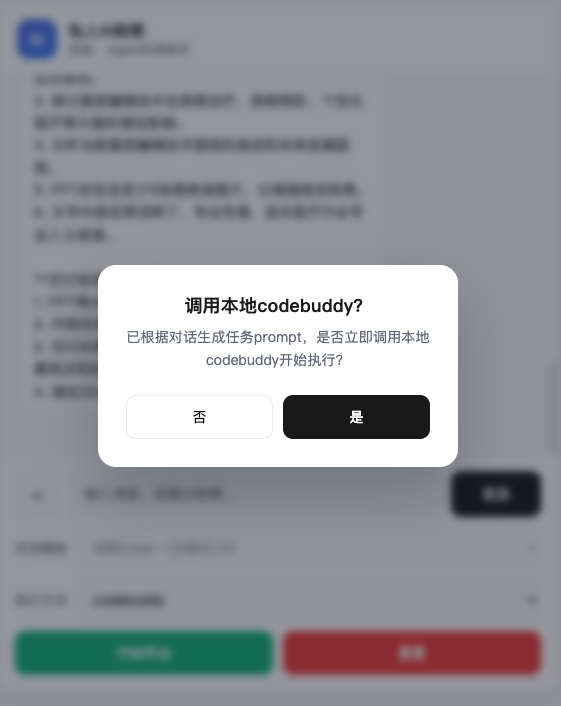
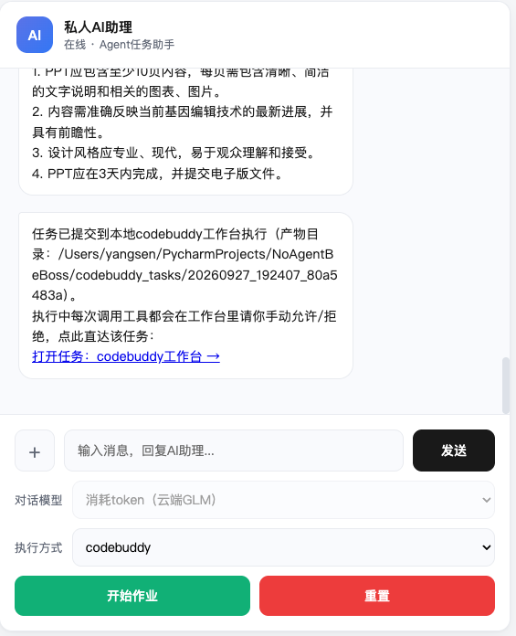
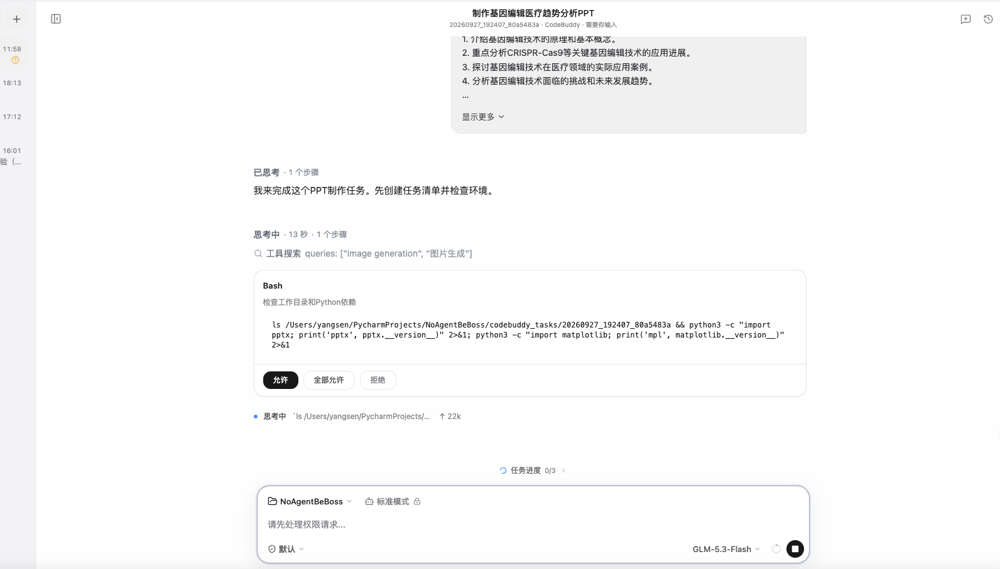

# pre-workbuddy

一个运行在 workbuddy 之前的"需求收集层",你的专属助理：先由 AI 扮演对应职业的专业人士，与甲方多轮对话摸清需求，自动生成最终任务 prompt，再一键交给 workbuddy / codebuddy 执行。

## 一、背景

1. workbuddy 以及国内如豆包工作等 AI 执行工具，目前提问环节太少，需求还未明确就开始做任务，做出来的东西需要经常返工修改。
2. 导致需要专业人士收集比较全面的需求文档才能用好这些工具，过于偏执行层面；且执行耗时较长、等待时间长，动辄几分钟到十几分钟。
3. 忽略了正常的乙方向甲方收集需求的过程——现实中的甲方（如小商、小贩、小厂）最开始往往都不太清楚自己要什么。
4. 学习成本过高：要求用户每次看完执行结果再提修改意见，而现实中甲方不会从 demo 阶段就开始一轮一轮改。
5. token 消耗量大，贵。

## 二、解决方案：pre-workbuddy

1. 项目集成了 2000 多种职业，匹配专人专事服务。
2. 通过提前多轮对话，了解甲方需求后再调用 workbuddy，更贴近前期乙方对甲方需求的收集阶段。
3. 普适性：pre-workbuddy 扮演对应职业角色，了解需求后自动生成最终 prompt，交给 workbuddy 执行，全流程引导式操作，学习成本低。
4. 便宜：集成了便宜的 glm-flash API 和本地 Qwen 大模型，对话成本几乎忽略不计。
5. 更早阶段的自动化：完成"需求收集 → 任务执行"的全流程自动化。

## 三、安装与实验流程

### 1. 安装 Python 依赖

```bash
pip install -r requirements.txt
```

可选：如需"不消耗 token"的本地模型对话模式，再安装 llama-cpp-python 并下载模型（约 2.6G）：

```bash
pip install llama-cpp-python
./download_model.sh   # 下载 Qwen3.5-4B-Q4_K_M.gguf 到 model_file/
```

然后在 [config.py](config.py) 中把 `use_local_model` 改为 `True`，并在 `API_KEY` 填入智谱 GLM 的 key（云端模式需要）。

### 2. 安装部署 codebuddy

```bash
# 安装 codebuddy CLI
curl -fsSL https://copilot.tencent.com/cli/install.sh | bash
source ~/.zshenv
codebuddy --version

# 启动 daemon（端口需与 config.py 中 CODEBUDDY_DAEMON_URL 一致）
codebuddy daemon start --port 8000
codebuddy daemon status
```

### 3. 启动网站

```bash
# 运行前记得修改config里的API_KEY，如果用的是其他家的model，也记得自行修改里面的key和url，切记
# 如果需要加载本地model，请自行修改config里的use_local_model参数，切记
python index.py
```

浏览器打开 http://127.0.0.1:5000 即可开始：选择职业 → 多轮对话收集需求 → 生成 prompt → 跳转 codebuddy 执行。

## 四、网站效果

选择职业：



多轮对话收集需求：



生成最终 prompt：



跳转 codebuddy：




codebuddy 执行：



## 五、TODO

- [ ] 完成英文化
- [ ] 完成 app、web 端多端支持
- [ ] 完成本地用户信息私有化
- [ ] 完成软硬一体
- [ ] 完成自动化训练

## License

[MIT](LICENSE)
